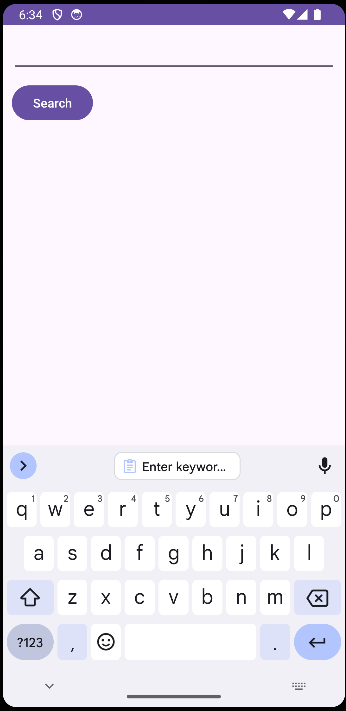
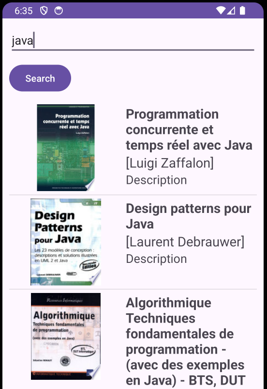

# Books Consulting App

Books Consulting App is a mobile application that allows users to search for books using the Google Books API and view details about the books, including title, authors, description.

## Features

- Search for books by entering keywords in the search bar.
- View a list of books matching the search criteria.
- View detailed information about each book, including title, authors, description.

## Technologies Used

- Java
- Retrofit (for API calls)
- Gson (for JSON serialization/deserialization)
- Picasso (for image loading)
- Android SDK

## Installation

1. Clone the repository:

   ```bash
   git clone https://github.com/your-username/books-consulting-app.git
    ```
2. Open the project in Android Studio.
3. Build and run the project on an Android emulator or device.

## Usage
1. Enter keywords related to the book you're looking for in the search bar.
2. Tap the search button to fetch books matching the search criteria.
3. Scroll through the list of books to find the one you're interested in.
4. Tap on a book to view detailed information about it (**I'm still working on it**).

## Screenshots




